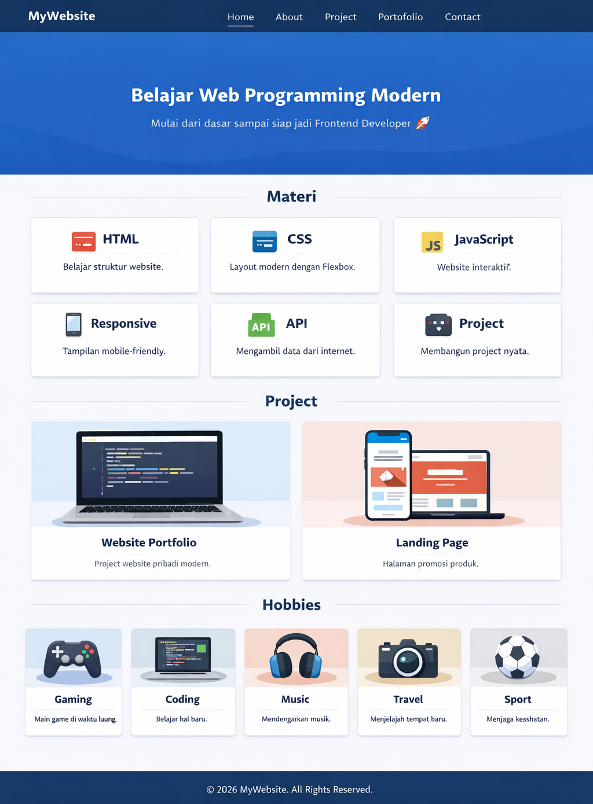

# 📝 Latihan

## 🎯 Tujuan

- Memahami penggunaan CSS dasar
- Memahami konsep Box Model
- Menguasai Flexbox untuk layout
- Mampu membuat layout sederhana (navbar + content)

---

## 📌 Instruksi

Buat tampilan website sederhana menggunakan HTML & CSS dengan ketentuan:



### 1. Navbar
- Gunakan Flexbox
- Berisi:
  - Logo / Judul di kiri
  - Menu di kanan (Home, About, Contact, Project, Portofolio)
- Harus sejajar (horizontal)

---

### 2. Hero Section
- Berisi:
  - Judul
  - Deskripsi singkat
- Posisi teks di tengah

---

### 3. Content (Card)
- Buat 3 card sejajar sebanyak 2 baris
- Gunakan Flexbox
- Setiap card berisi:
  - Judul
  - Deskripsi
- Beri:
  - padding
  - background
  - border-radius

---

### 4. Project (2 kolom)
- Gunakan Flexbox
- Setiap project berisi:
  - Gambar
  - Judul
  - Deskripsi
- Beri:
  - padding
  - background
  - border-radius

---

### 5. Hobbies (Card)
- Buat 5 card sejajar 
- Gunakan Flexbox
- Setiap project berisi:
  - Gambar
  - Judul
  - Deskripsi
- Beri:
  - padding
  - background
  - border-radius

---

### 6. Footer
- Teks rata tengah
- Berisi copyright

---

## ⭐ Challenge

🔥 Upgrade tampilan kamu:

1. Tambahkan efek hover pada card:
   - Card sedikit membesar / berubah warna saat disentuh

2. Tambahkan button di dalam card:
   - Gunakan class reusable `.btn`

---

## 💡 Tips

- Gunakan `display: flex` pada parent
- Gunakan `gap` untuk jarak (jangan margin berlebihan)
- Gunakan `justify-content` untuk horizontal
- Gunakan `align-items` untuk vertical
- Gunakan `flex: 1` agar ukuran sama

---

## 📂 **PENGUMPULAN TUGAS**

- Simpan file tugas yang telah dikerjakan pada folder penugasan sebagai berikut:
    - Masukkan kedalam folder nama kamu 
    - Jika belum ada folder nama kamu silahkan dibuat sendiri
    ```text
    penugasan/nama_kamu/
    ```
    - Lalu buat folder lagi dengan nama persis dengan materi penugasan
    ```text
    penugasan/nama_kamu/01-html-semantic/
    ```
    - Letakkan semua file yang telah anda buat sesuai pada instruksi penugasan pada folder tersebut

---

👉 Ini akan dipelajari lebih dalam di pertemuan berikutnya (Responsive Design)